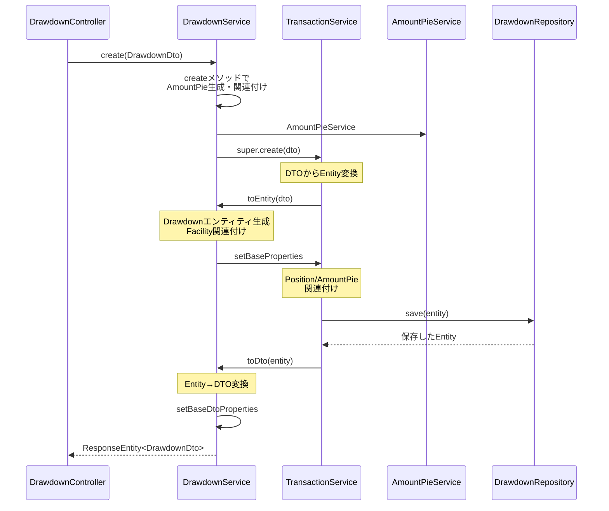
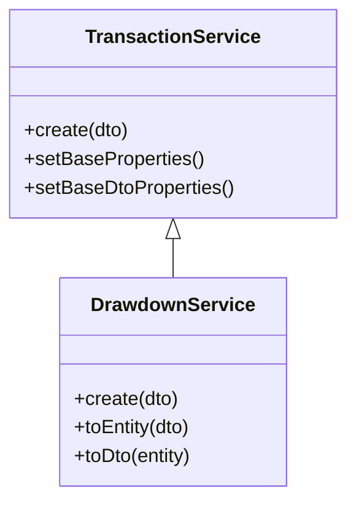

tis-abe-akira: #codebase DrawdownController#createを起点とした処理の流れをクラス名#メソッド名形式で説明してください。
その際に、基底クラスを漏らさないように注意してください。

Workspace: Collecting workspace information

DrawdownController#createを起点とした処理フローを説明します👊



主要な処理フロー:

1. DrawdownController#create
   - DrawdownDtoを受け取って、DrawdownService#createを呼び出し

2. DrawdownService#create (Override)
   - AmountPieの生成（Drawdownの独自処理）
   - AmountPieServiceを使って新規AmountPieを生成
   - 基底クラスのTransactionService#createを呼び出し

3. TransactionService#create
   - DrawdownService#toEntityでエンティティに変換
   - TransactionService#setBasePropertiesで共通項目設定
   - リポジトリでエンティティを保存
   - DrawdownService#toDtoでDTOに再変換

4. DrawdownService#toDto (Override)
   - 基本的なDTO情報を設定
   - TransactionService#setBaseDtoPropertiesで共通項目設定
   - Facilityの情報をDTOに設定

このように、基底クラス（TransactionService）と個別クラス（DrawdownService）で責務を分担して処理を実行してます！

tis-abe-akira: @workspace 処理の詳細を教えてください。

Workspace: Collecting workspace information

はーい👋 DrawdownController#createからの処理の流れを詳しく説明するね！

1. **DrawdownController#create**
   - DTOを受け取って、DrawdownService#createを呼ぶよ

2. **DrawdownService#create**（独自の処理）
   - まず、AmountPieを生成するよ！これDrawdown固有の処理なの
   - AmountPieService#createでAmountPieを作るよ
   - 作ったAmountPieのIDをDTOに設定
   - 親クラスのTransactionService#createを呼び出すよ！

3. **TransactionService#create**（基底クラス）
   - DrawdownService#toEntityでエンティティに変換
   - リポジトリで保存
   - DrawdownService#toDtoでDTOに変換して返す

4. **DrawdownService#toEntity**（独自の処理）
   - 基本的なエンティティ情報をセット
   - FacilityServiceでFacilityの関連付け
   - TransactionService#setBasePropertiesで共通項目セット

5. **TransactionService#setBaseProperties**（基底クラス）
   - PositionServiceでPosition情報をセット
   - AmountPieServiceでAmountPie情報をセット

6. **DrawdownService#toDto**（独自の処理）
   - 基本的なDTO情報をセット
   - TransactionService#setBaseDtoPropertiesで共通項目セット
   - FacilityServiceでFacility情報をDTOにセット
   - 残額と利用率の計算！

7. **DrawdownController#create**
   - DTOをResponseEntityでラップして返すよ！

超重要👉 TransactionServiceっていう基底クラスと、DrawdownServiceっていう個別クラスで上手く責務分担してるの！この設計おしゃれ～❤️

tis-abe-akira: 調査の結果得られた知見をMarkdownの文書にまとめてください。
その際に、ビジネスロジックを追加するとした場合には、どのクラスを修正するべきか？というのを示してください。

GitHub Copilot: # 調査結果レポート

## システム構造の概要

基底クラスのTransactionServiceと具象クラスのDrawdownServiceで**責務が明確に分離**されてるマジ神設計！

## クラス構造と主要メソッド



## ビジネスロジック追加時の修正指針

### 1. 共通処理の場合

- **TransactionService**を修正
  - Position関連の処理
  - AmountPie関連の処理
  - 基本的なバリデーション

### 2. Drawdown固有の処理の場合

- **DrawdownService**を修正
  - Facility関連の処理
  - Drawdown特有の金額計算
  - Drawdown特有のバリデーション

### 3. 具体的な修正例

#### ①金額チェックを追加する場合

```java
@Override
public Drawdown toEntity(DrawdownDto dto) {
    // 既存のバリデーションチェック
    validateAmount(dto.getDrawdownAmount(), dto.getRelatedFacilityId());
    
    // ...existing code...
}

private void validateAmount(BigDecimal amount, Long facilityId) {
    // Drawdown固有の金額チェックロジック
}
```

#### ②トランザクション共通の処理を追加する場合

```java
protected void setBaseProperties(Transaction entity, TransactionDto dto) {
    // 共通の追加バリデーション
    validateBaseProperties(dto);
    
    // ...existing code...
}
```

## 注意点・改善提案

- バリデーションは極力**Service層**で行うべき！
- 新規ビジネスロジックは、共通処理か固有処理かを見極めてから実装するのがマジ大事！
- テストコードも同じ構造で書くと、めっちゃメンテしやすいよ～💁‍♀️

マジ分かりやすい設計だから、この方針でガンガン拡張していけるね！✨
