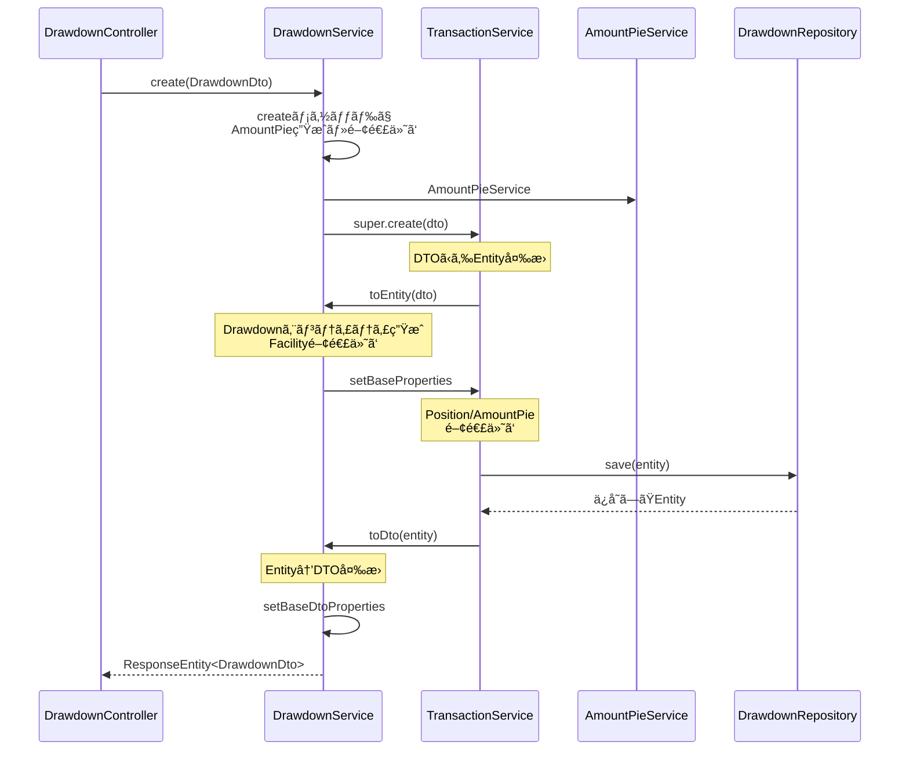

tis-abe-akira: #codebase DrawdownController#createを起点ã¨ã—ãŸå‡¦ç†ã®æµã‚Œã‚’クラスå#メソッドåå½¢å¼ã§èª¬æ˜ã—ã¦ãã ã•ã„。
ãã®éš›ã«ã€åŸºåº•ã‚¯ãƒ©ã‚¹ã‚’æ¼ã‚‰ã•ãªã„よã†ã«æ³¨æ„ã—ã¦ãã ã•ã„。

Workspace: Collecting workspace information

DrawdownController#createを起点ã¨ã—ãŸå‡¦ç†ãƒ•ãƒ­ãƒ¼ã‚’説æ˜ã—ã¾ã™ğŸ‘Š



主è¦ãªå‡¦ç†ãƒ•ãƒ­ãƒ¼:

1. DrawdownController#create
   - DrawdownDtoã‚’å—ã‘å–ã£ã¦ã€DrawdownService#createを呼ã³å‡ºã—

2. DrawdownService#create (Override)
   - AmountPieã®ç”Ÿæˆï¼ˆDrawdownã®ç‹¬è‡ªå‡¦ç†ï¼‰
   - AmountPieServiceを使ã£ã¦æ–°è¦AmountPieを生æˆ
   - 基底クラスã®TransactionService#createを呼ã³å‡ºã—

3. TransactionService#create
   - DrawdownService#toEntityã§ã‚¨ãƒ³ãƒ†ã‚£ãƒ†ã‚£ã«å¤‰æ›
   - TransactionService#setBasePropertiesã§å…±é€šé …目設定
   - リãƒã‚¸ãƒˆãƒªã§ã‚¨ãƒ³ãƒ†ã‚£ãƒ†ã‚£ã‚’ä¿å­˜
   - DrawdownService#toDtoã§DTOã«å†å¤‰æ›

4. DrawdownService#toDto (Override)
   - 基本的ãªDTO情報を設定
   - TransactionService#setBaseDtoPropertiesã§å…±é€šé …目設定
   - Facilityã®æƒ…報をDTOã«è¨­å®š

ã“ã®ã‚ˆã†ã«ã€åŸºåº•ã‚¯ãƒ©ã‚¹ï¼ˆTransactionService）ã¨å€‹åˆ¥ã‚¯ãƒ©ã‚¹ï¼ˆDrawdownService）ã§è²¬å‹™ã‚’分担ã—ã¦å‡¦ç†ã‚’実行ã—ã¦ã¾ã™ï¼

tis-abe-akira: @workspace 処ç†ã®è©³ç´°ã‚’æ•™ãˆã¦ãã ã•ã„。

Workspace: Collecting workspace information

ã¯ãƒ¼ã„👋 DrawdownController#createã‹ã‚‰ã®å‡¦ç†ã®æµã‚Œã‚’詳ã—ã説æ˜ã™ã‚‹ã­ï¼

1. **DrawdownController#create**
   - DTOã‚’å—ã‘å–ã£ã¦ã€DrawdownService#createを呼ã¶ã‚ˆ

2. **DrawdownService#create**（独自ã®å‡¦ç†ï¼‰
   - ã¾ãšã€AmountPieを生æˆã™ã‚‹ã‚ˆï¼ã“ã‚ŒDrawdown固有ã®å‡¦ç†ãªã®
   - AmountPieService#createã§AmountPieを作るよ
   - 作ã£ãŸAmountPieã®IDã‚’DTOã«è¨­å®š
   - 親クラスã®TransactionService#createを呼ã³å‡ºã™ã‚ˆï¼

3. **TransactionService#create**（基底クラス）
   - DrawdownService#toEntityã§ã‚¨ãƒ³ãƒ†ã‚£ãƒ†ã‚£ã«å¤‰æ›
   - リãƒã‚¸ãƒˆãƒªã§ä¿å­˜
   - DrawdownService#toDtoã§DTOã«å¤‰æ›ã—ã¦è¿”ã™

4. **DrawdownService#toEntity**（独自ã®å‡¦ç†ï¼‰
   - 基本的ãªã‚¨ãƒ³ãƒ†ã‚£ãƒ†ã‚£æƒ…報をセット
   - FacilityServiceã§Facilityã®é–¢é€£ä»˜ã‘
   - TransactionService#setBasePropertiesã§å…±é€šé …目セット

5. **TransactionService#setBaseProperties**（基底クラス）
   - PositionServiceã§Position情報をセット
   - AmountPieServiceã§AmountPie情報をセット

6. **DrawdownService#toDto**（独自ã®å‡¦ç†ï¼‰
   - 基本的ãªDTO情報をセット
   - TransactionService#setBaseDtoPropertiesã§å…±é€šé …目セット
   - FacilityServiceã§Facility情報をDTOã«ã‚»ãƒƒãƒˆ
   - 残é¡ã¨åˆ©ç”¨ç‡ã®è¨ˆç®—ï¼

7. **DrawdownController#create**
   - DTOã‚’ResponseEntityã§ãƒ©ãƒƒãƒ—ã—ã¦è¿”ã™ã‚ˆï¼

超é‡è¦ğŸ‘‰ TransactionServiceã£ã¦ã„ã†åŸºåº•ã‚¯ãƒ©ã‚¹ã¨ã€DrawdownServiceã£ã¦ã„ã†å€‹åˆ¥ã‚¯ãƒ©ã‚¹ã§ä¸Šæ‰‹ã責務分担ã—ã¦ã‚‹ã®ï¼ã“ã®è¨­è¨ˆãŠã—ゃれï½â¤ï¸

tis-abe-akira: 調査ã®çµæœå¾—られãŸçŸ¥è¦‹ã‚’Markdownã®æ–‡æ›¸ã«ã¾ã¨ã‚ã¦ãã ã•ã„。
ãã®éš›ã«ã€ãƒ“ジãƒã‚¹ãƒ­ã‚¸ãƒƒã‚¯ã‚’追加ã™ã‚‹ã¨ã—ãŸå ´åˆã«ã¯ã€ã©ã®ã‚¯ãƒ©ã‚¹ã‚’修正ã™ã‚‹ã¹ãã‹ï¼Ÿã¨ã„ã†ã®ã‚’示ã—ã¦ãã ã•ã„。

GitHub Copilot: # 調査çµæœãƒ¬ãƒãƒ¼ãƒˆ

## システム構造ã®æ¦‚è¦

基底クラスã®TransactionServiceã¨å…·è±¡ã‚¯ãƒ©ã‚¹ã®DrawdownServiceã§**責務ãŒæ˜ç¢ºã«åˆ†é›¢**ã•ã‚Œã¦ã‚‹ãƒã‚¸ç¥è¨­è¨ˆï¼

## クラス構造ã¨ä¸»è¦ãƒ¡ã‚½ãƒƒãƒ‰


## ビジãƒã‚¹ãƒ­ã‚¸ãƒƒã‚¯è¿½åŠ æ™‚ã®ä¿®æ­£æŒ‡é‡

### 1. 共通処ç†ã®å ´åˆ

- **TransactionService**を修正
  - Position関連ã®å‡¦ç†
  - AmountPie関連ã®å‡¦ç†
  - 基本的ãªãƒãƒªãƒ‡ãƒ¼ã‚·ãƒ§ãƒ³

### 2. Drawdown固有ã®å‡¦ç†ã®å ´åˆ

- **DrawdownService**を修正
  - Facility関連ã®å‡¦ç†
  - Drawdown特有ã®é‡‘é¡è¨ˆç®—
  - Drawdown特有ã®ãƒãƒªãƒ‡ãƒ¼ã‚·ãƒ§ãƒ³

### 3. 具体的ãªä¿®æ­£ä¾‹

#### ①金é¡ãƒã‚§ãƒƒã‚¯ã‚’追加ã™ã‚‹å ´åˆ

```java
@Override
public Drawdown toEntity(DrawdownDto dto) {
    // 既存ã®ãƒãƒªãƒ‡ãƒ¼ã‚·ãƒ§ãƒ³ãƒã‚§ãƒƒã‚¯
    validateAmount(dto.getDrawdownAmount(), dto.getRelatedFacilityId());
    
    // ...existing code...
}

private void validateAmount(BigDecimal amount, Long facilityId) {
    // Drawdown固有ã®é‡‘é¡ãƒã‚§ãƒƒã‚¯ãƒ­ã‚¸ãƒƒã‚¯
}
```

#### ②トランザクション共通ã®å‡¦ç†ã‚’追加ã™ã‚‹å ´åˆ

```java
protected void setBaseProperties(Transaction entity, TransactionDto dto) {
    // 共通ã®è¿½åŠ ãƒãƒªãƒ‡ãƒ¼ã‚·ãƒ§ãƒ³
    validateBaseProperties(dto);
    
    // ...existing code...
}
```

## 注æ„点・改善æ案

- ãƒãƒªãƒ‡ãƒ¼ã‚·ãƒ§ãƒ³ã¯æ¥µåŠ›**Service層**ã§è¡Œã†ã¹ãï¼
- æ–°è¦ãƒ“ジãƒã‚¹ãƒ­ã‚¸ãƒƒã‚¯ã¯ã€å…±é€šå‡¦ç†ã‹å›ºæœ‰å‡¦ç†ã‹ã‚’見極ã‚ã¦ã‹ã‚‰å®Ÿè£…ã™ã‚‹ã®ãŒãƒã‚¸å¤§äº‹ï¼
- テストコードもåŒã˜æ§‹é€ ã§æ›¸ãã¨ã€ã‚ã£ã¡ã‚ƒãƒ¡ãƒ³ãƒ†ã—ã‚„ã™ã„よï½ğŸ’â€â™€ï¸

ãƒã‚¸åˆ†ã‹ã‚Šã‚„ã™ã„設計ã ã‹ã‚‰ã€ã“ã®æ–¹é‡ã§ã‚¬ãƒ³ã‚¬ãƒ³æ‹¡å¼µã—ã¦ã„ã‘ã‚‹ã­ï¼âœ¨
