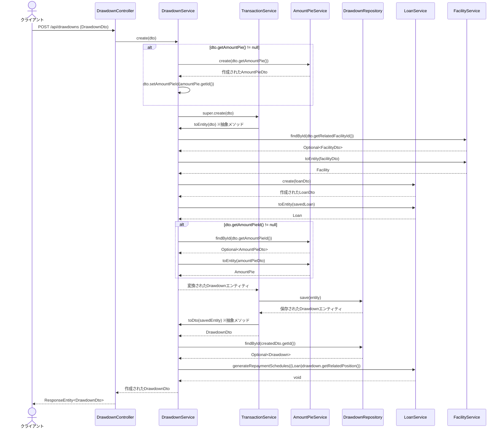

# DrawdownController#createの処理フロー図

## 処理フローの詳細解説

1. クライアントがHTTP POSTリクエストによりドローダウンの情報をコントローラに送信します。
2. コントローラはDrawdownServiceのcreateメソッドに処理を委譲します。
3. DrawdownServiceではAmountPie（資金の分配情報）が存在する場合、先にAmountPieServiceを利用して作成処理を行います。
4. 続いて親クラスであるTransactionServiceのcreateメソッドを呼び出し、基本的な登録処理を実行します。
5. DTOからエンティティへの変換処理はDrawdownServiceで実装されており、
6. その過程で関連するFacilityの取得、
7. 新規Loanエンティティの作成と永続化、
8. AmountPieの設定など複数の処理が行われる構成となっています。
9. エンティティの永続化後、返済スケジュール生成のためにLoanServiceが呼び出されます。
10. 最終的に作成されたドローダウンのDTOがクライアントに返却されます。

このような処理フローは、ドメイン駆動設計の観点から見ると適切に責務が分散されており、トランザクションの一貫性を保ちつつ、各コンポーネントが連携する優れた設計となっています。
