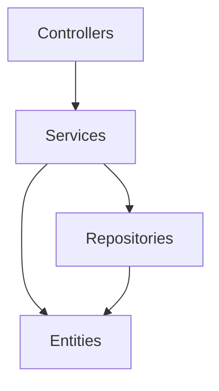
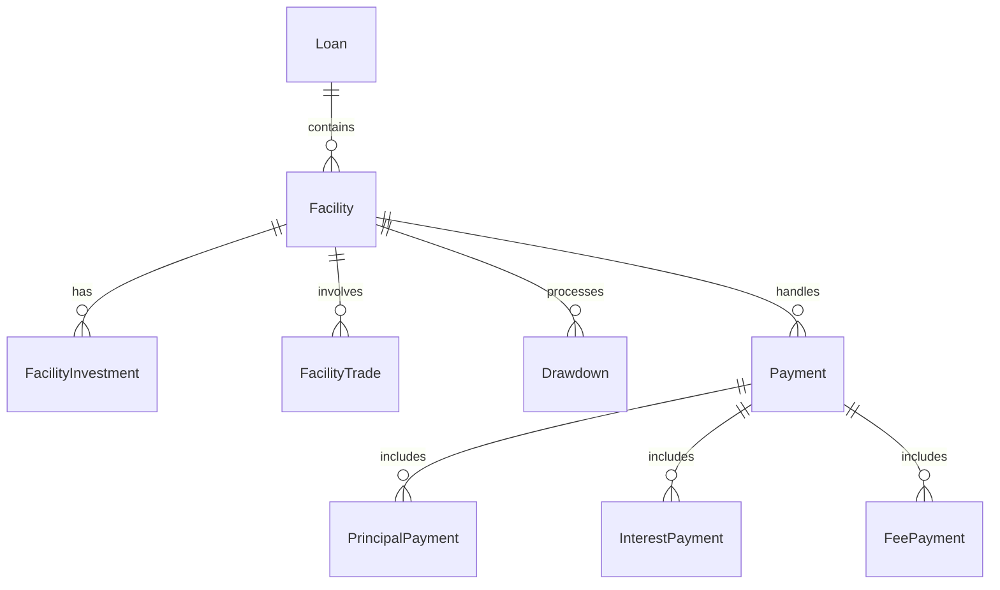

# System Patterns: Syndicated Loan Management System

## Architecture Overview

### Layer Architecture


### Package Structure
```
com.syndicated_loan.syndicated_loan/
├── common/
│   ├── advisor/     # Global exception handling
│   ├── aop/         # Aspect-oriented programming
│   ├── dto/         # Data transfer objects
│   ├── entity/      # Domain entities
│   ├── exception/   # Custom exceptions
│   ├── repository/  # Data access
│   ├── service/     # Business logic
│   └── testutil/    # Testing utilities
└── feature/
    ├── master/      # Master data management
    ├── position/    # Position tracking
    └── transaction/ # Transaction processing
```

## Design Patterns

### Domain-Driven Design (DDD)
1. **Entities**
   - Rich domain models
   - Business logic encapsulation
   - Clear boundaries and responsibilities

2. **Value Objects**
   - Immutable objects
   - Business rule validation
   - Self-contained logic

3. **Aggregates**
   - Transaction boundaries
   - Consistency guarantees
   - Clear ownership

4. **Repositories**
   - Data access abstraction
   - Domain-focused interfaces
   - Persistence management

### Service Layer Pattern
1. **Abstract Base Service**
   - Common CRUD operations
   - Shared business logic
   - Consistent error handling

2. **Specialized Services**
   - Domain-specific logic
   - Complex operations
   - Transaction management

### Controller Pattern
1. **Feature-based Controllers**
   - Clear responsibility boundaries
   - REST endpoint grouping
   - Input validation

## Key Technical Decisions

### Error Handling
1. Global exception advisor
2. Custom business exceptions
3. Structured error responses
4. Consistent error patterns

### Logging
1. AOP-based logging
2. Transaction tracking
3. Performance monitoring
4. Debugging support

### Testing
1. Unit tests for services
2. SQL test data
3. Test utilities
4. Builder patterns

## Data Model

### Core Entities


## Transaction Patterns

### Payment Processing
1. Payment type hierarchy
2. Share-based calculations
3. Position updates
4. Balance tracking

### Trade Settlement
1. Position transfers
2. Share recalculations
3. Payment reallocations
4. History tracking

## Integration Patterns

### REST APIs
1. Resource-based endpoints
2. Standard HTTP methods
3. Consistent response formats
4. Proper status codes

### Data Transfer
1. DTOs for external communication
2. Mapping patterns
3. Validation rules
4. Conversion logic
